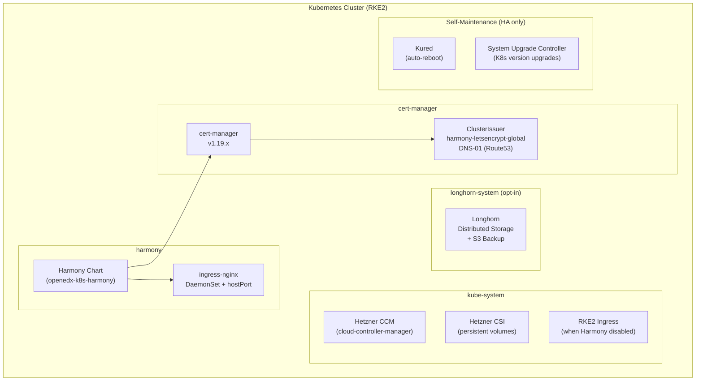
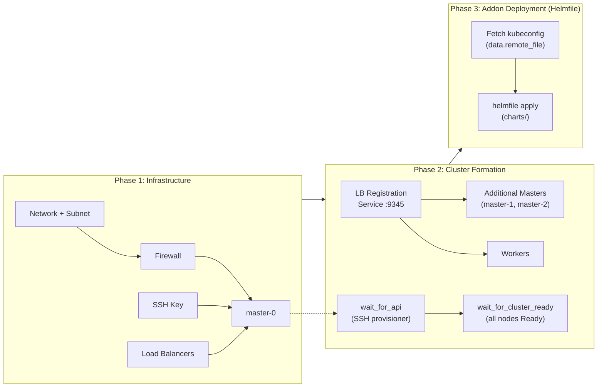
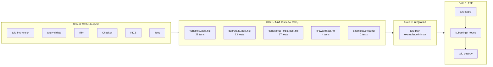

# Architecture Document

> **Module**: `terraform-hcloud-rke2`
> **Status**: **Experimental** — under active development, not production-ready
> **Target**: Enterprise-grade, best-practice aligned (aspirational)
> **Last updated**: 2026-02-23

---

## Table of Contents

- [Design Philosophy](#design-philosophy)
- [Module Architecture](#module-architecture)
- [Module Core](#module-core)
- [Infrastructure Topology](#infrastructure-topology)
- [Kubernetes Addon Stack](#kubernetes-addon-stack)
- [Deployment Flow](#deployment-flow)
- [Security Model](#security-model)
- [Why Ubuntu](#why-ubuntu)
- [Why Hetzner Cloud](#why-hetzner-cloud)
- [Why RKE2](#why-rke2)
- [Dual Load Balancer Architecture](#dual-load-balancer-architecture)
- [High Availability](#high-availability)
- [CI Quality Gates](#ci-quality-gates)
- [Compromise Log](#compromise-log)
- [Roadmap](#roadmap)
- [Out of Scope](#out-of-scope)

---

## Design Philosophy

This module is guided by six **engineering objectives**. These are practical design targets, each tied to concrete implementation choices and explicit limitations.


| Principle | Meaning |
|-----------|---------|
| **Security Baseline** | Encryption at rest, TLS automation, private networking, and explicit firewall controls are enabled by default. Production hardening is still required (CIDR restriction, bastion/VPN, policy layers). |
| **Operator Efficiency** | The recommended topology is designed for single-command bootstrap with sensible defaults. Non-standard combinations are supported, but may require explicit configuration. |
| **Cost-Effective EU Hosting** | The default topology targets pragmatic HA in EU regions (~€38/mo for 3×cx22 masters + 3×cx22 workers + 2×lb11, including IPv4 costs). Actual monthly total depends on IPv4, storage volumes, and traffic. Workloads remain portable at the Kubernetes layer. |
| **Open edX Compatibility** | Defaults align with Open edX ecosystem conventions (ClusterIssuer naming, ingress behavior, cert-manager expectations) while keeping the module usable outside Open edX. |
| **Resilience (HA Scope)** | Automated node reboots and Kubernetes upgrade workflows are available for HA clusters. Backup/DR and incident response remain operator responsibilities. |
| **Incremental Hardening** | Improvements are delivered in verifiable steps. Trade-offs are documented in the Compromise Log, and planned controls are explicitly marked as planned. |

### Technology Choices

Each objective maps to specific, opinionated implementation choices:

| Objective | Implementation |
|-----------|---------------|
| Security Baseline | RKE2 (CIS hardened, FIPS-capable), secrets encryption at rest, Hetzner firewall, ED25519 SSH keys, private network isolation |
| Operator Efficiency | Single `tofu apply`, Helm-managed addon lifecycle, auto-generated SSH keys, `terraform-docs` integration |
| Cost-Effective EU Hosting | Hetzner Cloud EU (Nuremberg, Falkenstein, Helsinki), GDPR-native, ~€38/mo for 3×cx22 masters + 3×cx22 workers + 2×lb11 (non-default HA config) |
| Open edX Compatibility | Ubuntu 24.04 LTS (AppArmor for codejail), openedx-k8s-harmony chart, `harmony-letsencrypt-global` ClusterIssuer convention |
| Resilience (HA Scope) | Kured (auto-reboot, HA only), System Upgrade Controller (K8s upgrades, HA only), RKE2 embedded etcd snapshots |
| Incremental Hardening | IaC patterns, `terraform-docs`, `.pre-commit-config.yaml`, and a documented Compromise Log; CI security scanning (Checkov, KICS, tfsec) implemented |

The primary constraint is Hetzner Cloud platform limitations and the balance between custom-built complexity and off-the-shelf pragmatism.

---

## Module Architecture

The module uses a **layered architecture** that separates infrastructure provisioning (Terraform) from Kubernetes addon deployment (Helmfile/GitOps). The root module is a **thin shim** that calls the infrastructure child module.

```
terraform-hcloud-rke2/            # Root module (shim)
├── main.tf                       # module "infrastructure" call + locals
├── variables.tf                  # All user-facing variables
├── output.tf                     # Rewired to module.infrastructure.* outputs
├── providers.tf                  # Provider configs (hcloud, aws, etc.)
├── guardrails.tf                 # All preflight check {} blocks
├── moved.tf                      # 67 moved blocks for state migration
│
├── modules/
│   └── infrastructure/           # L3: Cloud resources + cluster bootstrap
│       ├── main.tf               # Servers (master, worker)
│       ├── ssh.tf                # SSH key generation (ED25519)
│       ├── network.tf            # Private network + subnet
│       ├── firewall.tf           # Hetzner Cloud Firewall
│       ├── load_balancer.tf      # Dual LB (control-plane + ingress)
│       ├── dns.tf                # Route53 wildcard record
│       ├── cloudinit.tf          # cloudinit_config data sources
│       ├── readiness.tf          # wait_for_api, wait_for_cluster_ready, kubeconfig
│       ├── locals.tf             # Kubeconfig parsing, etcd S3 endpoint
│       ├── data.tf               # Remote file (kubeconfig fetch)
│       ├── variables.tf          # Infrastructure-specific inputs
│       ├── outputs.tf            # Kubeconfig creds, IPs, network, cluster_ready
│       ├── versions.tf           # required_providers (hcloud, cloudinit, etc.)
│       ├── scripts/              # Cloud-init shell scripts
│       └── templates/cloudinit/  # RKE2 config YAML templates
│
├── charts/                       # L4: Kubernetes addons (Helmfile, not Terraform)
│   ├── helmfile.yaml             # Addon deployment order + environment values
│   ├── README.md                 # Operator guide for Helmfile workflow
│   ├── hccm/                     # Hetzner Cloud Controller Manager
│   │   ├── values.yaml           # Helm values
│   │   ├── manifests/secret.yaml # hcloud API token secret
│   │   └── README.md             # HCCM-specific notes
│   ├── cert-manager/             # cert-manager + ClusterIssuer
│   │   ├── values.yaml           # Helm values
│   │   └── manifests/clusterissuer.yaml
│   ├── longhorn/                 # Longhorn distributed storage (opt-in)
│   │   ├── values.yaml           # Helm values
│   │   └── manifests/iscsi-installer.yaml
│   ├── kured/                    # Kured auto-reboot (HA only)
│   │   └── values.yaml
│   ├── system-upgrade-controller/ # K8s version upgrades (HA only)
│   │   ├── manifests/agent-plan.yaml
│   │   ├── manifests/server-plan.yaml
│   │   └── README.md
│   ├── harmony/                  # openedx-k8s-harmony (opt-in)
│   │   └── values.yaml
│   └── ingress/                  # RKE2 built-in ingress config
│       └── helmchartconfig.yaml
│
└── packer/                       # L1+L2: Machine image build
    ├── rke2-base.pkr.hcl         # Packer template for Hetzner Cloud
    ├── scripts/
    │   └── install-ansible.sh    # Bootstrap Ansible + Galaxy deps
    └── ansible/
        ├── playbook.yml          # Main playbook (rke2-base + optional CIS)
        ├── requirements.yml      # Galaxy deps (CIS role, collections)
        └── roles/
            ├── rke2-base/        # Always: packages, kernel, RKE2 binaries
            └── cis-hardening/    # Optional: CIS Level 1 wrapper (feature flag)
```

### Layer Separation

| Layer | Directory | Responsibility | Tools |
|:-----:|-----------|----------------|-------|
| L1+L2 | `packer/` | OS hardening (opt-in CIS Level 1), package pre-install, RKE2 binary pre-install | Packer + Ansible + [ansible-lockdown/UBUNTU24-CIS](https://github.com/ansible-lockdown/UBUNTU24-CIS) |
| L3 | `modules/infrastructure/` | Cloud resources, networking, servers, cloud-init, cluster bootstrap, kubeconfig | OpenTofu (hcloud, cloudinit, remote, aws, random, tls, local) |
| L4 | `charts/` | Kubernetes addons deployed after cluster is ready | Helmfile + kubectl (not Terraform) |
| Shim | Root (`/`) | Variable routing, provider config, guardrails, `moved` blocks | OpenTofu (7 providers configured here) |

### Design Decisions

**Root as shim, not orchestrator**: The root module contains zero resources. It declares providers, defines all user-facing variables, runs all preflight `check {}` blocks, and routes inputs to `module.infrastructure`.

**L4 addons managed outside Terraform**: All Kubernetes addons (HCCM, CSI, cert-manager, Longhorn, Harmony, etc.) are deployed via Helmfile from `charts/`, not via Terraform providers. This eliminates the chicken-and-egg problem of configuring kubernetes/helm providers inside the same apply that creates the cluster, and enables GitOps workflows (ArgoCD, Flux).

**Cloud-init inlined in infrastructure (not a separate module)**: Cloud-init templates need values from the infrastructure module (LB IP, RKE2 token from `random_password`) which are only known at apply time. Extracting cloud-init into a separate "bootstrap" module would create a circular dependency: servers need `user_data` from cloud-init, but cloud-init needs the LB IP from the server/LB resources. Inlining cloud-init in the infrastructure module keeps the dependency graph acyclic.

**Check blocks in root, not in child modules**: All `check {}` blocks live in root `guardrails.tf` so that `tofu test` can reference them as `check.name` without module path prefixes. This is a pragmatic choice — OpenTofu test `expect_failures` uses root-scoped addresses.

**State migration via `moved` blocks**: 67 `moved` blocks in `moved.tf` map every resource from its old root address to its new `module.infrastructure.*` address (plus `removed` blocks for deleted addon resources). This enables zero-downtime migration for existing deployments: `tofu plan` after upgrading shows only moves, no destroys.

### Provider Flow

```
Root module (provider configuration)
    │
    └── module.infrastructure
        └── uses: hcloud, cloudinit, remote, aws, random, tls, local
        └── outputs: cluster_host, client_cert, client_key, cluster_ca, ...

charts/ (Helmfile — outside Terraform)
    └── uses: helm, kubectl (via Helmfile CLI, not Terraform providers)
```

Providers are configured **in the root module only**. The child module declares `required_providers` (source + version) but does **not** contain `provider {}` blocks. Kubernetes-level providers (kubernetes, helm, kubectl) are no longer used in Terraform — addon deployment is handled by Helmfile in `charts/`.

---

## Module Core

```
┌─────────────────────────────────────────────────┐
│            terraform-hcloud-rke2                │
│                                                 │
│   Ubuntu 24.04 LTS (Hetzner ISO)               │
│   + RKE2 (Rancher Kubernetes Engine v2)         │
│   + openedx-k8s-harmony (opt-in)                │
│                                                 │
│   Can operate independently of Open edX,        │
│   but is adopted for and oriented toward it.    │
└─────────────────────────────────────────────────┘
```

The module's core is **Ubuntu + RKE2** — a production-oriented Kubernetes cluster on Hetzner Cloud. It can operate as a standalone Kubernetes platform for diverse workloads.

The **openedx-k8s-harmony** chart integration is the module's primary adoption target. The built-in compatibility with [Open edX](https://openedx.org/) community standards (ClusterIssuer naming, IngressClass conventions, cert-manager version alignment, proxy-body-size defaults) is a tribute to the Open edX community and a reflection of the module's origin: deploying production Open edX instances on Kubernetes with best practices and security.

> **⚠️ First deploy warning**: The module still needs production hardening after bootstrap:
> - defaults create `control_plane_count = 3`, `agent_node_count = 3` (HA baseline)
> - `harmony_enabled = false` by default — enable Harmony explicitly for Open edX
> - `ssh_allowed_cidrs` and `k8s_api_allowed_cidrs` default to `0.0.0.0/0` (open to the internet)
>
> A production-ready minimum: 3 masters, 3+ workers, restricted CIDRs.

---

## Infrastructure Topology


### Key Points

- **3 master nodes across 3 data centers** (Helsinki, Nuremberg, Falkenstein) — default order from `node_locations = ["hel1", "nbg1", "fsn1"]`. All within the `eu-central` network zone but in separate physical locations for datacenter-level fault tolerance.
- **Dedicated worker pool** for application workloads with ingress-nginx running as DaemonSet using hostPort.
- **Dual load balancer** architecture — control plane and ingress traffic are isolated (see [Dual LB Architecture](#dual-load-balancer-architecture)).
- **Private network** for all inter-node communication (etcd, kubelet, pod traffic via CNI overlay).
- **DNS via AWS Route53** — wildcard `*.domain` record pointing to the ingress LB. This is a temporary solution and will be replaced with a more sovereignty-aligned DNS provider in a future iteration.
- **⚠️ DNS depends on Harmony** — `create_dns_record = true` points DNS to the ingress LB, which exists only when `harmony_enabled = true`. The module now enforces this with an explicit preflight `check`.
- **No egress filtering** — all outbound traffic from nodes is unrestricted (Hetzner default). Egress firewall rules are not currently implemented.

---

## Kubernetes Addon Stack



| Component | Role | Notes |
|-----------|------|-------|
| **Hetzner CCM** | Cloud controller (node lifecycle, LB integration) | Shared `hcloud` secret with CSI. Deployed via `charts/hccm/`. |
| **Hetzner CSI** | Persistent volumes (`hcloud-volumes` StorageClass) | Pre-installed via RKE2 cloud-init config (`cloud-provider-name: external`). |
| **cert-manager** | TLS certificate automation | ClusterIssuer name matches Harmony convention. Deployed via `charts/cert-manager/`. |
| **Longhorn** | Distributed block storage + native S3 backup | Opt-in, experimental. Deployed via `charts/longhorn/`. |
| **Harmony** | Open edX Kubernetes orchestration | Opt-in. When enabled, disables RKE2 built-in ingress and deploys Harmony ingress-nginx. Deployed via `charts/harmony/`. |
| **Kured** | Automatic node reboot after OS updates | HA only, skipped on single-master clusters. Deployed via `charts/kured/`. |
| **System Upgrade Controller** | Automated K8s version upgrades | HA only, follows `stable` channel. Deployed via `charts/system-upgrade-controller/`. |

> **NOTE:** All addons are deployed via Helmfile (`charts/helmfile.yaml`), not via Terraform. See `charts/README.md` for the operator workflow.

### Harmony: default TLS certificate bootstrap

**DECISION: Provide a default HTTPS certificate when Harmony is enabled**

**Why:** openedx-k8s-harmony ships an HTTP-only "echo" Ingress by default (no `tls:` block). Until
Tutor creates per-host Ingress objects with cert-manager annotations, ingress-nginx falls back to
its self-signed "Fake Certificate" for catch-all HTTPS — which is a poor out-of-the-box operator
experience and often misdiagnosed as "cert-manager is broken".

This module optionally:

- creates a cert-manager `Certificate` for `var.domain` in the `harmony` namespace
- configures Harmony's ingress-nginx controller with `--default-ssl-certificate=harmony/<secret>`

This makes `https://<domain>/` present a valid certificate even before Open edX is deployed.

**See:** https://kubernetes.github.io/ingress-nginx/user-guide/tls/#default-ssl-certificate

This behavior is configured in `charts/harmony/values.yaml` and controlled at the Helmfile level.

---

## Deployment Flow



### Phase 1: Infrastructure (parallel)

1. **Network** — private network `10.0.0.0/16` with subnet `10.0.1.0/24`
2. **Firewall** — cluster-wide ingress rules (currently mixed-role; role-split hardening planned)
3. **SSH key** — auto-generated TLS key pair, uploaded to Hetzner
4. **Load balancers** — control-plane LB (always) + ingress LB (when Harmony enabled)
5. **master-0** — first control-plane node, bootstraps the cluster

### Phase 2: Cluster Formation (sequential)

6. **LB registration service** (port 9345) — enables additional nodes to join
7. **Additional masters** — join via LB → master-0 (etcd quorum formed)
8. **Workers** — join via LB → any master
9. **wait_for_api** — SSH into master-0, poll until API server responds (uses `terraform_data` with SSH provisioner — provisioners are a Terraform anti-pattern, but the only option without external tooling)
10. **wait_for_cluster_ready** — poll until all nodes report `Ready` (also via SSH provisioner)

### Phase 3: Addon Deployment (Helmfile — outside Terraform)

11. **Fetch kubeconfig** — downloaded from master-0 via SSH (still part of Terraform apply)
12. **Helmfile apply** — operator runs `helmfile apply` in `charts/` to deploy all Kubernetes addons (HCCM, CSI, cert-manager, Longhorn, Harmony, Kured, SUC) in the order defined by `charts/helmfile.yaml`

---

## Security Model

```mermaid
flowchart LR
    subgraph security["Security Layers"]
        direction TB
        L1["Layer 1: Infrastructure\nHetzner Firewall + UFW (CIS opt-in)\nSSH key auth (ED25519)\nPrivate network isolation\nCIS Level 1 OS hardening (opt-in)"]
        L2["Layer 2: Kubernetes\nRBAC · Pod Security Standards\nSecrets encryption at rest\nNetwork Policies"]
        L3["Layer 3: Application\ncert-manager TLS everywhere\nModSecurity WAF (Harmony-off only)"]
        L4["Layer 4: Operations\nSAST / IaC security scanning\nAudit logging\nAutomated OS patching (Kured)"]
        L1 --> L2 --> L3 --> L4
    end
```



### Principles

- **Security by default** — secrets encryption, SSH key auth, and TLS are enabled by default; network exposure defaults should be restricted for production.
- **Zero trust** — target state; explicit controls are in place, with additional policy layers (NetworkPolicy, audit) planned.
- **Least privilege** — partially implemented today (RBAC + explicit rules); firewall split by node role is planned.
- **Defense in depth** — multiple overlapping layers (network, K8s, application, operational)

### Layer 1: Infrastructure

| Control | Implementation | Status |
|---------|---------------|--------|
| Firewall | Hetzner Cloud Firewall with cluster-wide mixed-role rules; split-by-role hardening is planned | 🟡 Partially implemented |
| Host-level firewall (UFW) | CIS Section 4 disabled — Hetzner Cloud Firewall is the compensating control (filters at hypervisor level, before traffic reaches VM). UFW/nftables disabled to prevent conflicts with Kubernetes CNI iptables rules. | 🟠 Disabled (compensating control) |
| OS hardening (CIS Level 1) | Ubuntu 24.04 CIS Benchmark v1.0.0 via [ansible-lockdown/UBUNTU24-CIS](https://github.com/ansible-lockdown/UBUNTU24-CIS). Applied at Packer build time. SSH hardening, file permissions, warning banners. | 🟢 Opt-in (Packer `enable_cis_hardening`) |
| AppArmor | Enforce mode globally (~114 system profiles). Container-runtime profiles (busybox, crun, runc, buildah, ch-run, ch-checkns) set to complain mode for K8s compatibility. containerd CRI profile (`cri-containerd.apparmor.d`) stays enforce. Required for Open edX codejail sandbox. | 🟢 Opt-in (Packer `enable_cis_hardening`) |
| SSH authentication | Auto-generated ED25519 key pair, no password auth | ✅ Implemented |
| Network isolation | Private network for inter-node traffic | ✅ Implemented |
| SSH access restriction | Configurable `ssh_allowed_cidrs` | ✅ Implemented |
| K8s API restriction | Configurable `k8s_api_allowed_cidrs` | ✅ Implemented |
| Egress filtering | Not implemented — all outbound traffic is allowed (Hetzner default) | 🔲 Not implemented |

### Layer 2: Kubernetes

| Control | Implementation | Status |
|---------|---------------|--------|
| Secrets encryption at rest | RKE2 `secrets-encryption: true` | ✅ Implemented |
| RBAC | Kubernetes native RBAC | ✅ Built-in (RKE2) |
| Pod Security Standards | Admission controller | 🔲 Planned |
| Network Policies | Default deny + explicit allow | 🔲 Planned |

### Layer 3: Application

| Control | Implementation | Status |
|---------|---------------|--------|
| TLS everywhere | cert-manager + Let's Encrypt ClusterIssuer | ✅ Implemented |
| ModSecurity WAF | Configurable via Harmony ingress-nginx values | 🔲 Planned |

### Layer 4: Operations

| Control | Implementation | Status |
|---------|---------------|--------|
| SAST / security scanning | Checkov, KICS, tfsec (CI Gate 0b) | ✅ Implemented |
| Audit logging | K8s audit policy | 🔲 Planned |
| Automated OS patching | Kured (HA clusters only) | ✅ Implemented |
| K8s version upgrades | System Upgrade Controller (HA only) | ✅ Implemented |

### Important: What This Module Does NOT Cover

Security of the Ubuntu host OS can be addressed via the **optional CIS hardening** feature in the Packer image builder (`packer/`). When `enable_cis_hardening=true`, the image is built with CIS Level 1 controls applied at build time, including AppArmor enforce mode (with targeted complain-mode exceptions for container-runtime profiles), SSH hardening, and file permission controls. Host-level firewall (CIS Section 4) is disabled — Hetzner Cloud Firewall serves as the compensating control.

**Without CIS hardening** (default): The module provisions the server and installs RKE2, but hardening the OS (sysctl tuning, unnecessary service removal, file permissions, PAM configuration) remains the operator's responsibility. See `packer/README.md` for details.

The module's Terraform code, Helm charts, and Kubernetes manifests are continuously scanned via CI (Checkov, KICS, tfsec — see [CI Quality Gates](#ci-quality-gates)).

### Operational Limitations

- **SSH private key is not exposed as a module output.** To SSH into nodes for debugging, extract the key from Terraform state (`tls_private_key.ssh_identity.private_key_openssh`) or enable `save_ssh_key_locally = true` to write it to disk.
- **Longer first apply for safer addon sequencing** — `data.remote_file.kubeconfig` now depends on `wait_for_cluster_ready` to avoid early addon races while workers are still joining. This improves determinism at the cost of slower initial provisioning.

---

## Why Ubuntu

Ubuntu is the chosen operating system for the following reasons:

1. **Open edX community standard** — Ubuntu is the [recommended distribution](https://docs.openedx.org/) for Open edX deployments, with the most thoroughly tested installation paths and community support.

2. **AppArmor compatibility** — Open edX's [codejail](https://github.com/openedx/codejail) plugin, which provides sandboxed code execution for student-facing embedded terminals in courses, requires **AppArmor** for process isolation. AppArmor is a Linux Security Module (LSM) that cannot coexist at the kernel level with **SELinux**, which is the mandatory LSM on all RHEL-family distributions (Fedora, CentOS, Rocky, Alma, SUSE). The Hetzner Cloud ISO mirror provides pre-built images with SELinux enabled by default on these distributions. Replacing SELinux with AppArmor would require rebuilding the ISO with different kernel parameters — adding significant operational complexity with no benefit.

3. **LTS release stability** — Ubuntu LTS releases (20.04 → 22.04 → 24.04) provide 5-year support cycles with a proven track record in production environments. The `apt` package manager and the built-in `do-release-upgrade` tool provide a safe upgrade path between LTS versions.

4. **Hetzner Cloud availability** — Ubuntu 24.04 is a first-class ISO image on Hetzner Cloud, maintained and updated by Hetzner's mirror infrastructure.

---

## Why Hetzner Cloud

1. **European sovereignty** — data centers in Germany (Nuremberg, Falkenstein) and Finland (Helsinki). Student data, course content, and platform operations stay within EU jurisdiction, fully compliant with GDPR.

2. **Cost efficiency** — Hetzner offers some of the best price-to-performance ratios in Europe. A production HA cluster (3 masters + 3 workers + 2 LBs) costs approximately **€38/month** — making production-grade Open edX accessible to universities, NGOs, and small enterprises.

3. **Controlled lock-in at infrastructure layer** — this module is intentionally optimized for Hetzner primitives (CCM, CSI, firewall/LB semantics). The workload and application layer (Open edX / Harmony on Kubernetes) remains portable.

---

## Why RKE2

[RKE2](https://docs.rke2.io/) (Rancher Kubernetes Engine v2) was chosen over alternatives (k3s, kubeadm, managed K8s services) for the following reasons:

1. **FIPS 140-2 compliance** — RKE2 is the only lightweight Kubernetes distribution that offers FIPS-validated cryptographic modules, relevant for government and regulated education deployments.

2. **CIS hardened by default** — RKE2 ships with CIS Kubernetes Benchmark profiles applied out of the box, reducing the security hardening burden.

3. **Built-in components** — includes ingress-nginx, metrics-server, and CoreDNS as managed Helm charts (HelmChartConfig CRD), reducing external dependencies.

4. **etcd embedded** — no separate etcd cluster to manage. RKE2 bundles etcd with automatic snapshotting.

5. **Stable release cadence** — follows upstream Kubernetes releases with a focus on stability over bleeding-edge features.

> **Note**: The module **pins** RKE2 by default via the `rke2_version` input (currently `v1.34.x`).
> This makes first deployments reproducible. If you explicitly set `rke2_version = ""`, the install script will use the upstream `stable` channel (less reproducible but sometimes desirable for quick trials).

---

## Dual Load Balancer Architecture

The module deploys **two separate Hetzner Cloud load balancers** instead of a single shared one:

| LB | Role | Targets | Ports | Always Created |
|----|------|---------|-------|:-:|
| **Control Plane** | K8s API + node registration | Masters only | 6443, 9345, 22 (opt-in via `enable_ssh_on_lb`, default off) | Yes |
| **Ingress** | HTTP/HTTPS application traffic | Workers only | 80, 443, custom | When Harmony enabled |

### Why Not a Single LB?

1. **Hetzner Cloud LBs do not support per-service target groups.** All targets receive health checks from ALL services. With a single LB, workers fail health checks for K8s API (6443) and registration (9345) — showing "yellow" status in Hetzner console. The false-negative health status defeats monitoring and alerting.

2. **DDoS blast radius isolation.** If the public-facing ingress LB is under attack and saturated, the separate control-plane LB remains reachable — operators can still `kubectl` into the cluster to mitigate the incident.

3. **Independent scaling and lifecycle.** The ingress LB can be upgraded to `lb21`/`lb31` under load without touching the control-plane path. Firewall rules differ: API LB should be restricted (VPN/bastion), ingress LB must be public.

4. **Industry standard.** This is the pattern used by AWS EKS (NLB for API + ALB for Ingress), GKE, and AKS.

**Trade-off:** +1 `lb11` ≈ €5.39/month. Acceptable for production workloads where operational clarity and security isolation outweigh the cost.

> **Note**: Both LBs use type `lb11` (hardcoded). To scale the ingress LB under load (`lb21`/`lb31`), the module source must be modified — LB type is not currently exposed as a variable.

---

## High Availability

### etcd Quorum

The module defaults to **3 master nodes** for production HA deployments:

| Masters | etcd Members | Fault Tolerance | Verdict |
|:-------:|:------------:|:---------------:|---------|
| 1 | 1 | 0 (any failure = cluster down) | Dev / learning only |
| 2 | 2 | 0 (split-brain risk, **rejected**) | ❌ Blocked by validation |
| 3 | 3 | 1 node can fail | ✅ Production minimum |
| 5 | 5 | 2 nodes can fail | Large-scale production |

### Geographic Distribution

Master nodes are deployed across **three Hetzner data centers**, all within the `eu-central` network zone:

| Node | Data Center | Location |
|------|-------------|----------|
| master-0 | `hel1` | Helsinki, Finland |
| master-1 | `nbg1` | Nuremberg, Germany |
| master-2 | `fsn1` | Falkenstein, Germany |

This provides **datacenter-level fault tolerance** — the loss of an entire DC leaves the cluster operational with 2/3 etcd members (quorum maintained).

### Self-Maintenance (HA only)

On HA clusters (≥ 3 masters), two self-maintenance systems are deployed:

- **Kured** — monitors for pending OS reboots (after `apt upgrade`) and reboots nodes one at a time, respecting pod disruption budgets.
- **System Upgrade Controller** — automates Kubernetes version upgrades via the `stable` channel, draining nodes before upgrade.

Both are **disabled on single-master clusters** because rebooting or upgrading the only control-plane node causes full downtime.

---

## CI Quality Gates

The module uses a **layered quality gate pipeline** in GitHub Actions. Each gate catches progressively deeper issues, and every tool has its own workflow file and badge in the README.

### Quality Gate Pyramid

```
                    ╱╲
                   ╱  ╲          Gate 3: E2E
                  ╱ E2E╲         Real infra, apply + smoke + destroy, manual only
                 ╱──────╲
                ╱        ╲       Gate 2: Integration
               ╱  Plan    ╲     tofu plan with real providers, PR + manual
              ╱────────────╲
             ╱              ╲    Gate 1: Unit Tests
            ╱  57 unit tests ╲   tofu test + mock_provider, every PR, ~3s, $0
           ╱──────────────────╲
          ╱                    ╲  Gate 0: Static Analysis
         ╱  fmt · validate ·    ╲ tflint · Checkov · KICS · tfsec
        ╱────────────────────────╲
```

### Workflow Inventory

| Gate | Badge Label | Workflow File | Trigger | Cost |
|:----:|-------------|---------------|---------|:----:|
| 0a | Lint: fmt | `lint-fmt.yml` | push + PR | $0 |
| 0a | Lint: validate | `lint-validate.yml` | push + PR | $0 |
| 0a | Lint: tflint | `lint-tflint.yml` | push + PR | $0 |
| 0b | SAST: Checkov | `sast-checkov.yml` | push + PR | $0 |
| 0b | SAST: KICS | `sast-kics.yml` | push + PR | $0 |
| 0b | SAST: tfsec | `sast-tfsec.yml` | push + PR | $0 |
| 1 | Unit: variables | `unit-variables.yml` | push + PR | $0 |
| 1 | Unit: guardrails | `unit-guardrails.yml` | push + PR | $0 |
| 1 | Unit: conditionals | `unit-conditionals.yml` | push + PR | $0 |
| 1 | Unit: examples | `unit-examples.yml` | push + PR | $0 |
| 2 | Integration: plan | `integration-plan.yml` | PR + manual | $0 (plan only) |
| 3 | E2E: apply | `e2e-apply.yml` | Manual only | ~$0.50/run |

> **Trigger semantics**: Gates 0–1 fire on **every push to any branch** (including `main`) and on PRs targeting `main`. This provides instant feedback on feature branches without waiting for a PR. Gate 2 fires on PRs to `main` + manual dispatch (needs credentials). Gate 3 is manual-only with cost confirmation.

### Naming Convention

All workflow files follow the pattern `{category}-{tool}.yml`:
- **Category**: `lint`, `sast`, `unit`, `integration`, `e2e`
- **Badge label**: `Category: Tool` (e.g., `Lint: fmt`, `SAST: Checkov`, `Unit: variables`)

This ensures each badge maps 1:1 to exactly one workflow and one tool.

### Execution Flow



### Unit Test Architecture

All 57 unit tests run **offline** using `tofu test` with `mock_provider`:

| Test File | Tests | Scope |
|-----------|:-----:|-------|
| `variables.tftest.hcl` | 21 | Every `validation {}` block with positive + negative cases |
| `guardrails.tftest.hcl` | 13 | Every `check {}` block (incl. etcd backup and Longhorn guardrails; DNS untestable) |
| `conditional_logic.tftest.hcl` | 17 | Resource count assertions for all feature toggles |
| `firewall.tftest.hcl` | 4 | Firewall rule assertions (protocol, port, direction) |
| `examples.tftest.hcl` | 2 | Full-stack patterns (minimal, OpenEdX-Tutor) |

Key design decisions:
- **`mock_provider`** — all 7 providers mocked (hcloud, remote, aws, cloudinit, random, tls, local). Zero credentials, zero cost, ~3s total.
- **Plan-only** — tests run `command = plan`, never `apply`. No state, no side effects.
- **Per-file CI** — each test file has its own workflow using `tofu test -filter=tests/{file}.tftest.hcl` for granular badges.

See [tests/README.md](../tests/README.md) for detailed coverage traceability, mock workarounds, and test inventory.

### Integration & E2E Gates

**Integration (Gate 2):**
- Runs `tofu plan` in `examples/minimal/` with real Hetzner + AWS credentials
- Triggered on PRs and manual dispatch
- Skipped when `HAS_CLOUD_CREDENTIALS` repository variable is not `true`
- Validates provider compatibility and real resource planning without provisioning

**E2E (Gate 3):**
- Manual dispatch only with explicit cost confirmation checkbox
- Provisions real infrastructure in `examples/minimal/` (~$0.50/run)
- Runs smoke test: `kubectl get nodes` to verify cluster is operational
- Always destroys infrastructure on completion (even on failure)
- Full lifecycle: `init → plan → apply → smoke → destroy`

---

## Operations: Backup, Upgrade, Rollback

### Backup Strategy

The module implements a **two-layer backup architecture** separating cluster state from application data:

```
┌─────────────────────────────────────────────────────────┐
│                   Backup Targets                        │
│                                                         │
│  ┌──────────────────────┐  ┌─────────────────────────┐  │
│  │  Layer 1: etcd       │  │  Layer 2: PVC data      │  │
│  │  (cluster state)     │  │  (application data)     │  │
│  │                      │  │                          │  │
│  │  Mechanism: RKE2     │  │  Mechanism: Longhorn     │  │
│  │  native snapshots    │  │  native S3 backup        │  │
│  │                      │  │                          │  │
│  │  Config: cloud-init  │  │  Config: Helm release    │  │
│  │  (pre-K8s)           │  │  (requires running K8s)  │  │
│  └──────────┬───────────┘  └──────────┬──────────────┘  │
│             │                         │                  │
│             └─────────┬───────────────┘                  │
│                       ▼                                  │
│          Hetzner Object Storage (S3)                     │
│          {location}.your-objectstorage.com               │
│          Path-style only, 750 req/s limit                │
└─────────────────────────────────────────────────────────┘
```

#### Layer 1: etcd (RKE2 Native)

- **Mechanism:** RKE2's built-in `etcd-snapshot-schedule-cron` in `/etc/rancher/rke2/config.yaml`
- **Configured at:** cloud-init time (before Kubernetes starts)
- **S3 upload:** Optional, via `etcd-s3`, `etcd-s3-endpoint`, `etcd-s3-bucket` parameters
- **Path style:** `etcd-s3-bucket-lookup-type: path` (required for Hetzner Object Storage)
- **Retention:** `etcd-s3-retention` (RKE2 v1.34.0+, separate from local `etcd-snapshot-retention`)
- **Variable:** `cluster_configuration.etcd_backup`
- **See:** https://docs.rke2.io/datastore/backup_restore

#### Layer 2: PVC Data (Longhorn Native Backup)

- **Mechanism:** Longhorn distributed storage with native S3 backup (recurring jobs)
- **Why Longhorn:** Integrated storage + backup in a single component. Native VolumeSnapshot support (Hetzner CSI has none — [issue #849](https://github.com/hetznercloud/csi-driver/issues/849)). Instant COW pre-upgrade snapshots. Fewer components in restore path (1 vs 4 with Velero).
- **Backup target:** S3-compatible storage via `backup_target` variable (e.g. `s3://bucket@region/folder`)
- **Variable:** `cluster_configuration.longhorn` (independent credentials from etcd_backup)
- **File:** `charts/longhorn/` (Helmfile-managed, with guardrails in root `guardrails.tf`)
- **Status:** Experimental (`preinstall = false` by default)

#### Design Decisions

| Decision | Rationale |
|----------|----------|
| Separate etcd + Longhorn layers | etcd backup is pre-K8s (cloud-init), Longhorn requires running cluster. Different failure modes, different recovery paths. |
| Separate S3 credentials | Module's self-contained addon pattern. Each addon owns its config. Operators share credentials at invocation level if desired. |
| Longhorn over Velero + Kopia | Integrated storage + backup in single component. Fewer components in restore path (1 vs 4). Native VolumeSnapshot. Instant COW pre-upgrade snapshots. |
| Longhorn experimental default | Marked `preinstall = false` to allow gradual rollout. Hetzner CSI retained as stable fallback. |
| Path-style S3 | Hetzner Object Storage does not support virtual-hosted style. Both etcd and Longhorn require path-style configuration. |

### Upgrade Strategy

Upgrades follow a **snapshot-before-upgrade** pattern:

1. Pre-upgrade on-demand etcd snapshot (via System Upgrade Controller `prepare` hook)
2. Cordon + drain node
3. RKE2 binary upgrade (System Upgrade Controller)
4. Post-upgrade health check (`terraform_data.cluster_health_check`)

If the health check fails, the operator can restore the pre-upgrade etcd snapshot.

### Rollback Strategy

Full etcd restore (not binary downgrade) is the recommended rollback path:

1. Stop RKE2 on all nodes
2. Restore etcd snapshot on master-0
3. Start master-0, wait for API
4. Restart additional masters + workers
5. Longhorn volume restore (if PVC data affected)
6. Health check validation

**Why not binary downgrade:** Kubernetes API objects may have been migrated to newer schemas during upgrade. Binary downgrade leaves the cluster in an inconsistent state. etcd restore guarantees consistency.

---

## Compromise Log

The module contains many deliberate compromises. Each is documented in code comments at the point of implementation. Here is the summary:

| Decision | Compromise | Rationale |
|----------|-----------|-----------|
| SSH/API open by default | Security vs usability | Provisioners require SSH to master-0; blocking SSH causes `tofu apply` to hang. Follows terraform-aws-eks pattern. |
| Single firewall for all nodes | Granularity vs simplicity | A split firewall (master/worker) is planned. Current single firewall applies to all nodes — masters get HTTP/HTTPS rules they don't need, workers get etcd/API rules they don't need. Simpler to reason about and manage. |
| `terraform_data` provisioners | Idempotency vs necessity | Provisioners are a Terraform anti-pattern, but are the only way to wait for cluster readiness and fetch kubeconfig without external tooling. `terraform_data` (built-in) replaces `null_resource` for better lifecycle and no external provider dependency. |
| Providers inside module | Composability vs simplicity | Prevents provider aliasing and multi-account patterns. Provider extraction is planned as a breaking change. |
| Route53 for DNS | EU sovereignty vs maturity | Cloudflare was removed for sovereignty reasons. Route53 is a temporary solution — will be replaced with a more aligned provider. |
| `harmony_enabled` default `false` | Convention vs safety | Harmony remains opt-in by default so the module can serve both generic Kubernetes and Open edX use cases. Open edX deployments must enable it explicitly. |
| master-0 replacement race | Bootstrap vs lifecycle | `INITIAL_MASTER` flag is set at server create-time via `user_data` and never re-evaluated (`ignore_changes = [user_data]`). **We intentionally do not hard-block destroy** in the module baseline to keep full lifecycle management possible (dev/test). For production, protect master-0 operationally (reviews, environment protections, targeted plans) and treat replacement as a deliberate maintenance event. |
| DNS requires Harmony | Simplicity vs composability | `create_dns_record = true` targets the ingress LB, so `harmony_enabled = true` is required. This is now guarded by an explicit preflight `check` with a clear error. |
| RKE2 version pinned | Reproducibility vs freshness | RKE2 defaults to `v1.34.4+rke2r1` (latest in the Rancher-supported v1.34 line). Operators can override via `rke2_version` variable or set to `""` for latest stable. |
| L3/L4 separation | Separation vs workflow complexity | Infrastructure (L3) is managed by Terraform (`modules/infrastructure/`). Addons (L4) are managed by Helmfile (`charts/`). This eliminates the chicken-and-egg problem of K8s providers in the same apply that creates the cluster, but requires a two-step deploy: `tofu apply` then `helmfile apply`. |
| Cloud-init in infrastructure | Simplicity vs separation | Cloud-init templates live in `modules/infrastructure/` rather than a separate "bootstrap" module. Extracting them would create a circular dependency (cloud-init needs LB IP + RKE2 token from infrastructure). |
| Check blocks in root | Testability vs locality | All `check {}` blocks are in root `guardrails.tf` rather than co-located with the resources they guard. Required because `tofu test` references checks via root-scoped addresses (`check.name`). |
| UFW + Hetzner Firewall coexistence | Defense-in-depth vs complexity | When CIS hardening is enabled, UFW runs on each node alongside the Hetzner Cloud Firewall. Hetzner Firewall operates at L3 (stateless), UFW adds stateful host-level filtering. Requires maintaining K8s port allow-rules in the CIS wrapper role (`packer/ansible/roles/cis-hardening/`). |
| CIS Level 1 only | Security vs stability | CIS Level 2 controls (auditd, AIDE, restrictive mounts) may conflict with containerd, kubelet, and etcd. Level 1 provides a strong baseline without risking RKE2 breakage. Level 2 controls to be added incrementally after testing. |
| Single hardened image for both roles | Simplicity vs granularity | Master and worker nodes use the same Packer snapshot. Both RKE2 server and agent binaries are pre-installed. Role differentiation happens at cloud-init time (`systemctl start rke2-server` vs `rke2-agent`). Avoids double build pipeline. |

---

## Roadmap

The path from current state to enterprise-grade, grouped by priority:

### Near-term (active development)

- [ ] Fix critical bugs (DNS crash, SSH key leak, conflicting defaults)
- [ ] Split firewall per node role (master / worker)
- [ ] CIDR validation on all network variables
- [ ] Add ACME staging option for development
- [ ] Vendor external manifests (remove `data.http` from GitHub)
- [x] Packer CIS hardening opt-in — CIS Level 1 via `ansible-lockdown/UBUNTU24-CIS` with AppArmor enforce + Hetzner Cloud Firewall compensating control (`packer/`)
- [ ] AppArmor codejail profile — custom `openedx-codejail` profile for sandboxed student code execution (install at node level, reference from pod spec)
- [ ] CIS Level 2 incremental addition (auditd, AIDE) — requires RKE2 compatibility testing

### Mid-term

- [ ] Proxy protocol on ingress LB (real client IP visibility)
- [x] Add `moved` blocks for safe resource renames — **67 moved blocks** for nested module migration (`moved.tf`)
- [x] Add `.tftest.hcl` unit tests — **57 tests** across 5 files (variables, guardrails, conditional logic, firewall, examples)
- [x] GitHub Actions CI pipeline — **12 workflows** (lint ×3, SAST ×3, unit ×4, integration ×1, E2E ×1)
- [x] L3/L4 separation — addons extracted from Terraform to Helmfile (`charts/`)

### Long-term (enterprise-grade target)

- [ ] **Provider extraction** — remove all provider configurations from module (breaking change, major version bump)
- [x] etcd backup strategy (automated snapshots to S3-compatible storage) — **implemented** via `cluster_configuration.etcd_backup`
- [x] Longhorn native PVC backup to Hetzner Object Storage — **implemented** via `cluster_configuration.longhorn` (experimental)
- [ ] Longhorn backup observability (monitoring, alerting on failed backups)
- [ ] Automated restore drill / backup validation
- [ ] Network Policies (default deny + explicit allow)
- [ ] Pod Security Standards / admission policies
- [ ] Kubernetes audit logging
- [ ] Zero-downtime cluster upgrade strategy
- [x] Full `CHANGELOG.md`, `SECURITY.md`
- [ ] `CONTRIBUTING.md`
- [x] Integration tests — `tofu plan` with real providers (`integration-plan.yml`) + E2E apply/smoke/destroy (`e2e-apply.yml`)

---

## Out of Scope

The following are intentionally **not** part of this module:

| Topic | Reason |
|-------|--------|
| **OS-level hardening (beyond CIS L1)** | CIS Level 1 hardening is available as an opt-in Packer feature (`enable_cis_hardening=true`). CIS Level 2 and custom hardening beyond the benchmark remain the operator's responsibility. |
| **Application deployment** | The module deploys infrastructure and the Harmony chart. Individual Open edX instance deployment (Tutor) is a separate concern. |
| **Backup and disaster recovery** | The module provides etcd S3 backup (RKE2 native) and Longhorn native PVC backup to Hetzner Object Storage (experimental). Application-level consistency (pre-backup hooks, `mysqldump`/`mongodump`) is the operator's responsibility at the Tutor deployment layer. Restore drills and backup monitoring are on the roadmap. |
| **Multi-cluster federation** | The module deploys a single cluster. Multi-cluster patterns are out of scope. |
| **Custom CNI configuration** | The module supports CNI selection (canal, calico, cilium, none) but does not manage CNI-specific configuration (BGP peers, IP pools, etc.). |
| **CI/CD pipelines for applications** | The module provides infrastructure. Application CI/CD (ArgoCD, Flux, etc.) is a separate layer. |
